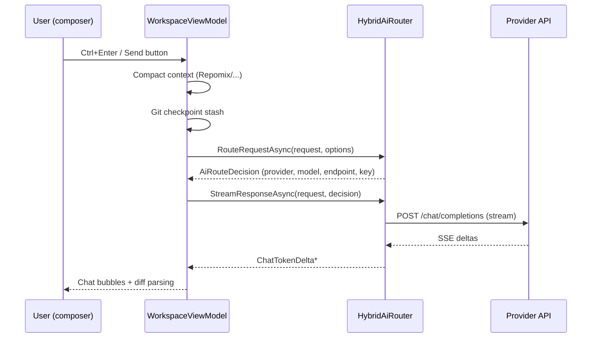

# Architecture Overview

Axion IDE is an Avalonia 12 desktop app on .NET 10 with a clean four-layer split.
This page is the map; every other dev page zooms into one area.

## Projects

```text
src/
  Axion.Core            Models, interfaces, enums. Zero dependencies.
  Axion.Infrastructure Implementations: SQLite vault, git (LibGit2Sharp),
                        AI router, compactors, terminal (ConPTY), plugins,
                        semantic search, activity log.
  Axion.App             Avalonia UI: views, view models, controls, theming.
  Axion.McpServer       Exposes Axion itself as an MCP server.
tests/
  Axion.Tests           xUnit suite (must stay 100% green).
```

## The request flow (chat)



## Key services (all in DI, see `App.axaml.cs`)

| Service | Implementation | Role |
|---------|----------------|------|
| `IWorkspaceService` | `SqliteEncryptedDatabase` | Encrypted vault: workspaces, tabs, conversations, UI state |
| `IAiRouter` | `HybridAiRouter` | Routing + OpenAI-compatible streaming |
| `ICompactorPipeline` | `CompactorPipeline` | Repomix / Code2Prompt / Ctags / Gitingest |
| `ITransactionalGitService` | `LibGit2SharpGitService` | Checkpoint stashes, status, diffs, push/pull |
| `IActivityLogService` | `SqliteActivityLogService` | Models/AC history + provider credits |
| `IPtyTerminalService` | `ConPtyTerminalService` | Integrated PowerShell terminal |
| `ISubAgentOrchestrator` | `SubAgentOrchestrator` | DAG planning |
| `IExternalMarketplaceService` | `OpenVsxMarketplaceService` | External marketplace search + `.vsix` download |
| `IExternalExtensionAnalyzer` | `ExternalExtensionAnalyzer` | Compatibility bouncer (can Axion run it?) |
| `ExternalExtensionInstaller` | `ExternalExtensionInstaller` | Unpack + wire up + theme conversion |
| `IBugReportService` | `BugReportService` | Pre-filled GitHub/Gitea issue builder |

## ViewModels and views

`WorkspaceViewModel` is the brain: one VM holds all state, commands, and
collections; `WorkspaceWindow.axaml` renders it as swappable full-screen views
(`MainViewMode` enum: EditorAndChat, SubAgentPipeline, Mcp, ... Design, Tools).
Code-behind only hosts click handlers that need dialogs or the terminal.

## Persistence

- `axion_vault.db` — AES-256 encrypted: workspaces, tabs, conversations, per-workspace UI state (mode), and app settings (installed external extensions).
- `activity.db` — plain SQLite: model calls, auto-continue steps, provider credits.

## ELI5 the whole thing

Axion is a shop. The **ViewModel** is the shopkeeper taking orders (your prompts).
The **router** is the dispatcher choosing which factory (provider) builds the
product. **Compactors** shrink the raw materials so they fit in the machine.
The **vault** is the safe where receipts and stashes live. And every shelf has a
label — that's the ELI5 comment convention.
