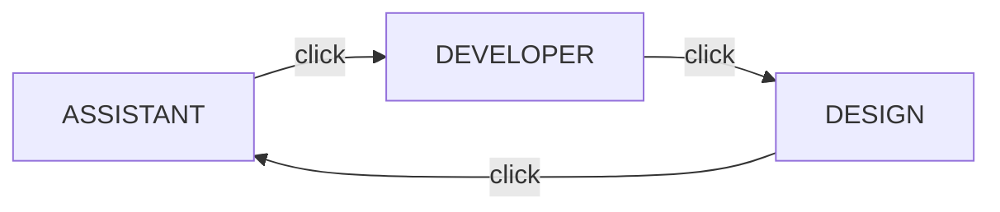

# Workspace Modes

The flat button in the top bar (left of the search box) cycles the workspace through
three modes. The label always shows the **current** mode.

The selected mode is saved **per workspace** (in the encrypted vault) and restored
when you reopen that workspace. No workspace loaded? Assistant is the default.

## ASSISTANT (default)

The chat-first experience:

- The **Axion AI Assistant** tab is permanent — it cannot be closed.
- File tabs open beside it; picking a file shows the editor, picking the
  Assistant tab returns to the chat.
- The composer at the bottom sends, or **queues** while the agent is busy.
- The **Plan & Tasks** tab shows the live plan with LED status per step.

## DEVELOPER

Coding-focused. Switching closes the AI Assistant completely:

- The editor takes the full center area (empty state if no file is open).
- The **Project Explorer** sidebar is surfaced automatically.
- The Assistant tab chip disappears from the tab strip.
- Built for the Developer toolkit: [Developer Tools](developer-tools.md) for
  toolchains, LSP/debugging groundwork, and the Source Control panel.

Switch back by clicking the mode button until it reads **ASSISTANT**.

## DESIGN

The visual UI builder. Drop widgets from the palette, arrange them in the design tree,
edit their settings in the property inspector, and export the result as Avalonia XAML,
HTML, or React. See [Design Mode](design-mode.md) for the full guide.
## Sidebars in every mode

The left navigation strip and the right sidebar (Project Explorer + diagnostics tabs) are
available in **all** modes — modes change the center area and the assistant, never the
sidebars.

### The navigation strip

The left strip is grouped and labelled, so related tools sit together:

| Group | Entries |
|-------|---------|
| **WORK** | Create, Context, Search |
| **AI** | Agents, Routing, Activity |
| **BUILD** | Tools, Run, Containers, Workflows |
| **EXTEND** | Extensions |
| **REPO** | Git |
| *(pinned)* | Settings, Profile, Collapse |

Entries that own more than one page are **split buttons**: the icon opens the main page, and
a caret on the right opens a menu of the others.

| Entry | Opens | Caret menu |
|-------|-------|------------|
| **Create** | Editor + AI chat | Session History |
| **Routing** | Cloud fallback rules | Auto-Continue Loop |
| **Activity** | Usage analytics | System Logs, Session History |
| **Run** | Debugger | Test Runner |
| **Extensions** | Marketplace | MCP Servers |

### Collapsing the strip

Click **Collapse** at the bottom of the strip to shrink it from the labelled layout (150px)
to icons only (54px) — handy on a narrow screen. The group headers hide too, since they would
be unreadable at that width.

The choice is **remembered per workspace**, so it survives a restart.
