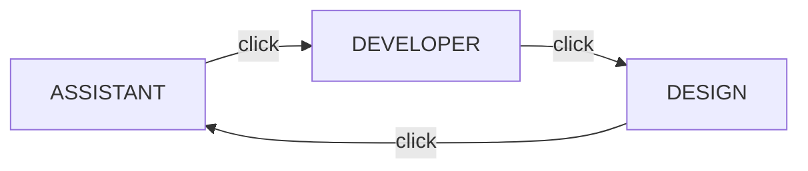

# Workspace Modes

The flat button in the top bar (left of the search box) cycles the workspace through
three modes. The label always shows the **current** mode.

The selected mode is saved **per workspace** (in the encrypted vault) and restored
when you reopen that workspace. No workspace loaded? Assistant is the default.

## ASSISTANT (default)

The chat-first experience:

- The **Axion AI Assistant** tab is permanent — it cannot be closed.
- File tabs open beside it; picking a file shows the editor, picking the
  Assistant tab returns to the chat.
- The composer at the bottom sends, or **queues** while the agent is busy.
- The **Plan & Tasks** tab shows the live plan with LED status per step.

## DEVELOPER

Coding-focused. Switching closes the AI Assistant completely:

- The editor takes the full center area (empty state if no file is open).
- The **Project Explorer** sidebar is surfaced automatically.
- The Assistant tab chip disappears from the tab strip.
- Built for the Developer toolkit: [Developer Tools](developer-tools.md) for
  toolchains, LSP/debugging groundwork, and the Source Control panel.

Switch back by clicking the mode button until it reads **ASSISTANT**.

## DESIGN (planned)

The visual UI builder. It currently shows a roadmap placeholder and a preview of the
planned **56-widget library** while the full builder is developed — see the
[Design Mode & Widget SDK spec](../dev/design-mode-spec.md).

## Sidebars in every mode

The left icon rail and the right sidebar (Project Explorer + diagnostics tabs) are
available in **all** modes — modes change the center area and the assistant, never
the sidebars.
